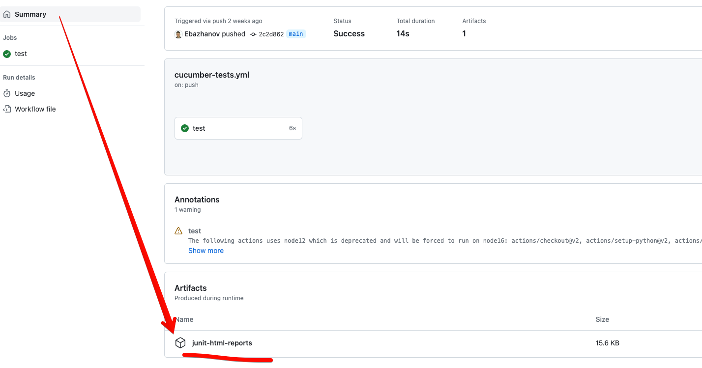
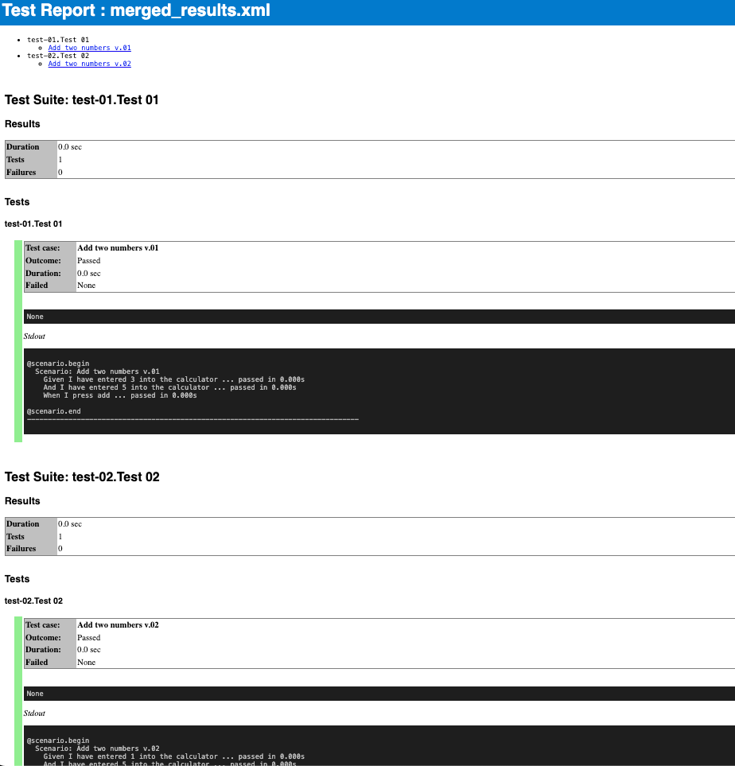

## Automated Testing with "junit2html" Plugin

This project utilizes the [junit2html](https://github.com/inorton/junit2html) plugin to convert test result files from `*.xml` format to `*.html`. Additionally, in the case of multiple test reports, the plugin is used to merge them into a single `*.html` report file.

### How to run E2E tests 
- `$ behave **/*.feature --junit`

### How to run Unit tests 
- `$ python -m unittest tests.test_your_module1`

#### Convert Junit to HTML report based on `xml` files
- Install plugin [junit2html](https://github.com/inorton/junit2html)
- `$ behave **/*.feature --junit` //Run tests
- `$ junit2html reports/*.xml --merge=merged_results.xml` // Merge all *.xml files in one
- `$ junit2html merged_results.xml --report-matrix=summary_report.html` // Generate HTML report

#### Convert Junit to HTML report based on `json` files
- Can be found in GitHub Actions -> Summary Report

- Report looks like this:

#### Project structure

    python-cucumber/
    |
    |-- .github/
    |   |-- workflows/
    |       |-- cucumber-test.yml
    |
    |-- src/
    |   |-- your_python_module1.py
    |
    |-- tests/
    |   |-- e2e/
    |   |   |-- features/
    |   |   |   |-- steps/
    |   |   |       |-- steps.py
    |   |   |   |-- test-01.feature
    |   |   |   |-- test-02.feature
    |   |   |-- steps/
    |   |       |-- steps.py
    |   |
    |   |-- unit/
    |       |-- test_your_module1.py
